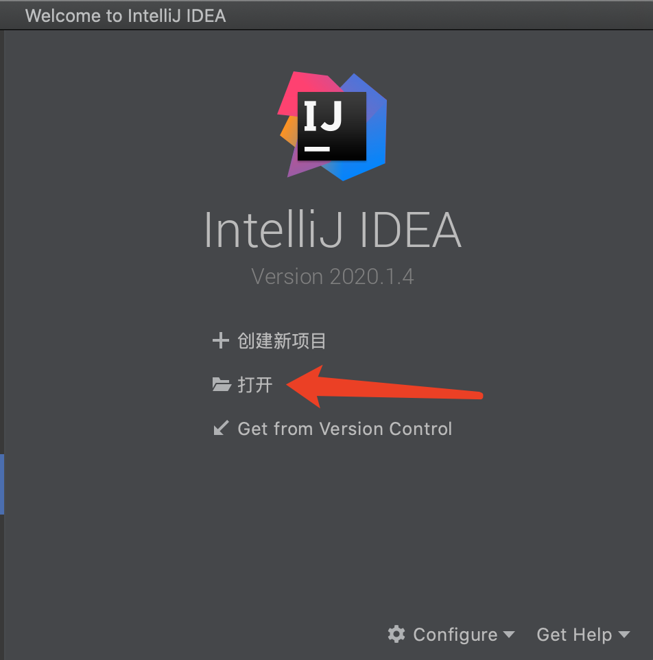
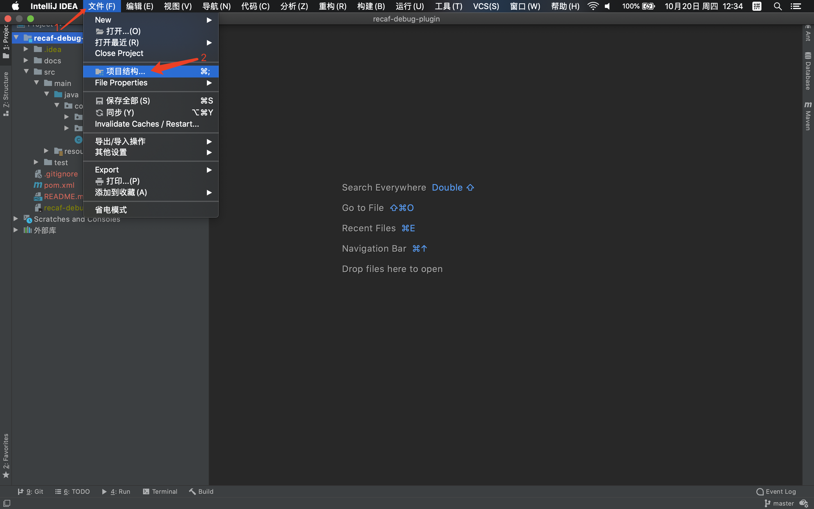
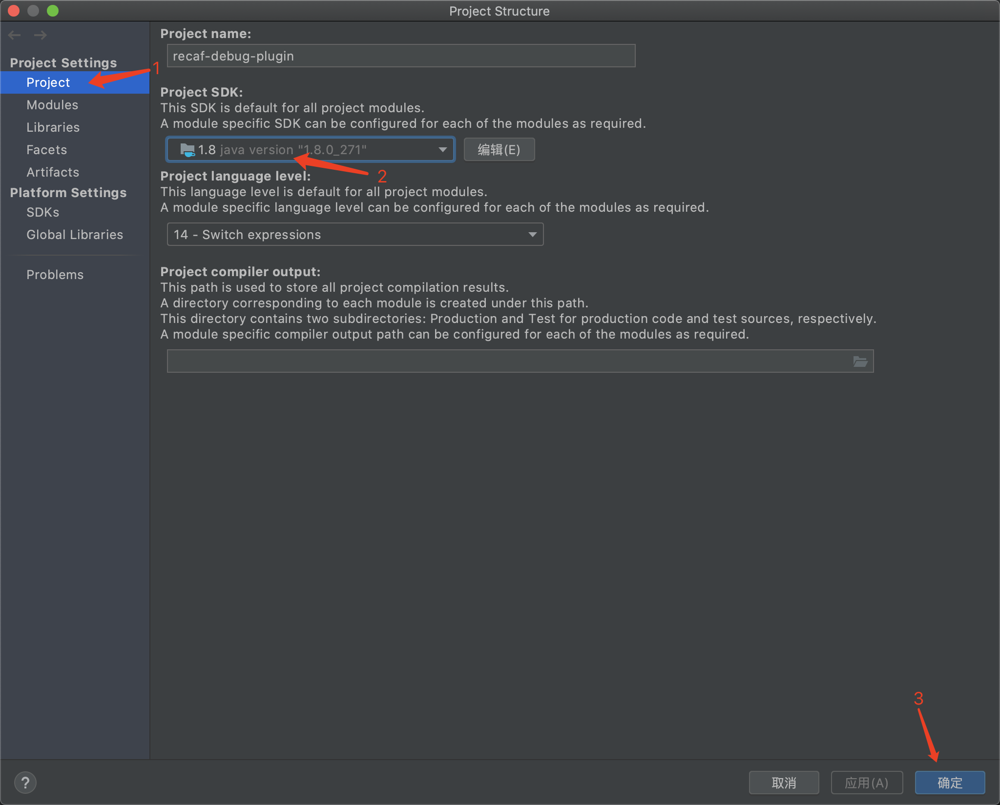
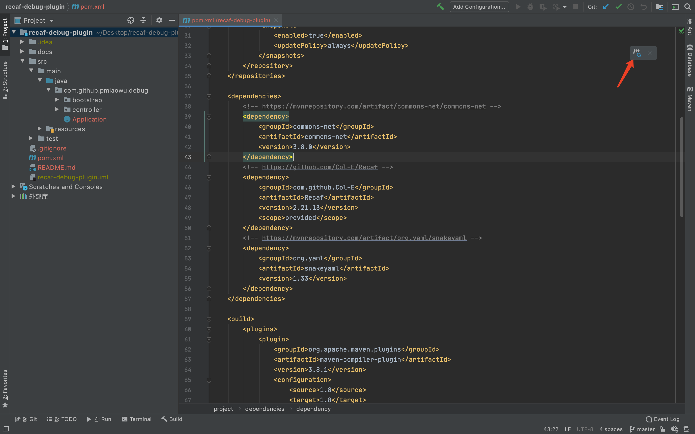
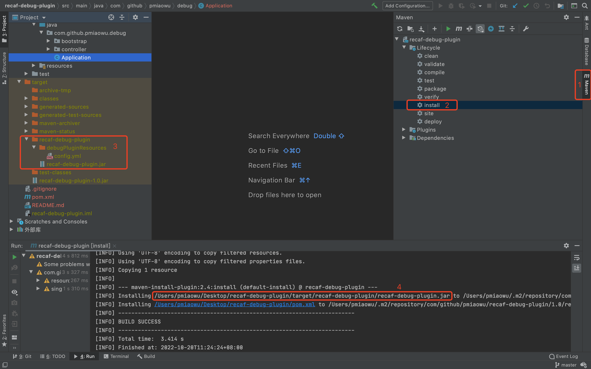
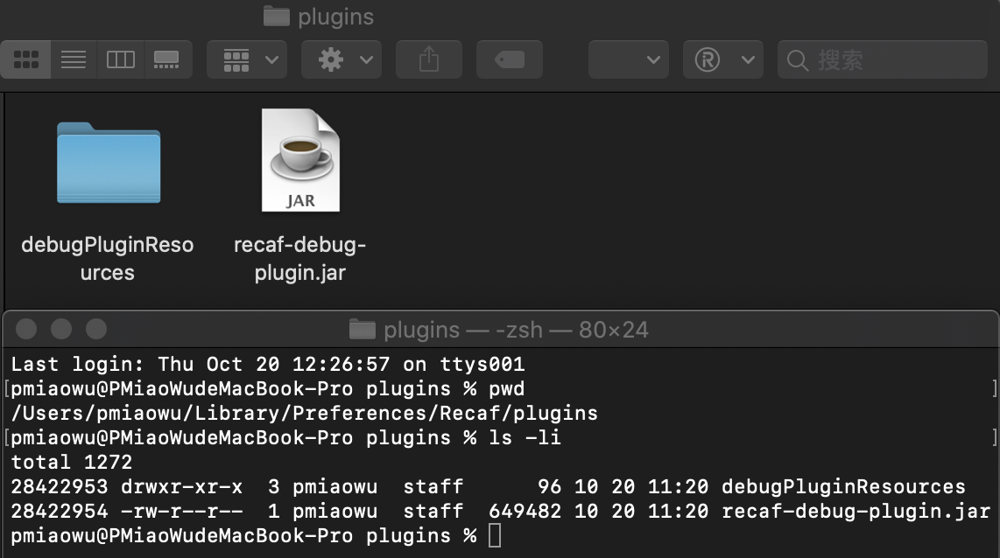
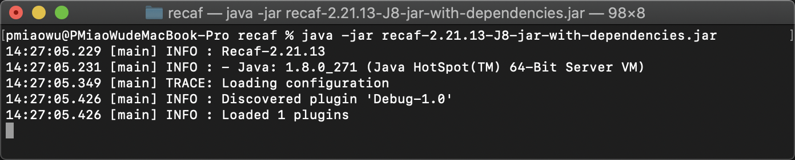
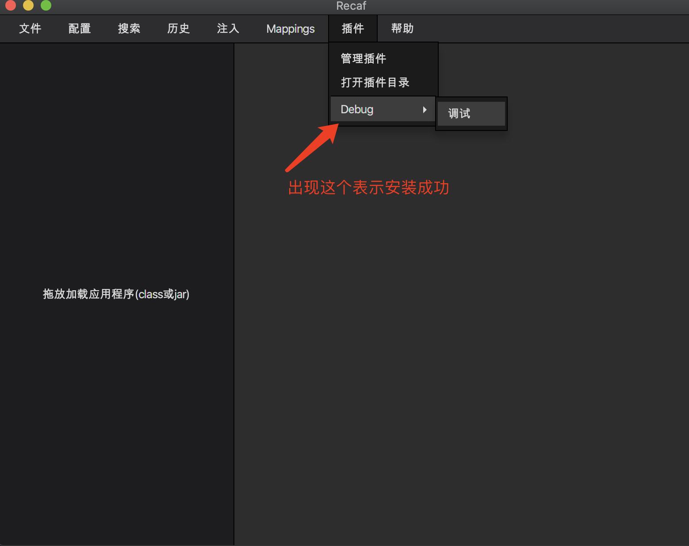

# recaf-debug-plugin
recaf一个易于使用的现代Java字节码编辑器,本项目是一款基于recaf的debug插件

# 简介
这是一个Debug调试插件,配合阿里巴巴开源的arthas,可以修改运行中的类字节码并让它实时生效

# 请注意!!!!
请使用jdk1.8编译,因为recaf使用了javafx,jdk1.8以后移除了javafx

请使用jdk1.8编译,因为recaf使用了javafx,jdk1.8以后移除了javafx

请使用jdk1.8编译,因为recaf使用了javafx,jdk1.8以后移除了javafx

# recaf
```
必须下载,因为recaf是软件本体
recaf-debug-plugin只是recaf的一个辅助插件

下载地址: https://github.com/Col-E/Recaf/tags
```

# arthas-boot
```
官网: https://arthas.aliyun.com/doc/
下载地址: https://arthas.aliyun.com/arthas-boot.jar (必须下载,因为要配合arthas才能正常使用)

基础使用:
运行: java -jar arthas-boot.jar --telnet-port [端口,默认是3658] --target-ip [对外的公网IP,默认是127.0.0.1]
退出arthas: stop (退出命令最好使用这个)
```

# 编译方法

<details>
<summary><b>编译方法</b></summary>
这是一个 java maven项目

默认java版本为 1.8

导入idea,打开刚刚好下载好的源码



设置项目jdk为 1.8





打开: /recaf-debug-plugin/pom.xml 安装对应的包,第一次安装依赖包需要比较久,慢慢等不要急





编译文件地址: /recaf-debug-plugin/target/recaf-debug-plugin/

jar包地址: /recaf-debug-plugin/target/recaf-debug-plugin/recaf-debug-plugin.jar

项目配置文件地址: /recaf-debug-plugin/target/recaf-debug-plugin/debugPluginResources/config.yml

接着拿着这个jar包,放在recaf的插件目录即可
</details>

# 安装方法

```
第一步:
打开 plugins 目录
Windows: "%APPDATA%/Recaf/plugins"
Linux: "$HOME/Recaf/plugins"
```

```
第二步:
把编译好的jar与debugPluginResources文件夹,全部复制到上述目录
```

```
第三步:
运行Recaf验证你的插件有没有加载
```







# 使用方法

```
例如:
机器A = 调试者的机器
机器B = 需要调试的目标机器
```

```
第一步:
机器B启动arthas
命令: java -jar arthas-boot.jar --telnet-port [端口,默认是3658] --target-ip [对外的公网IP,默认是127.0.0.1]

第二步:
机器B进入到arthas中,选择需要调试的jar包

第三步: 
机器A,打开debugPluginResources文件夹,里面的config.yml
修改config.yml里面的host与port字段为机器B对外开放的端口与公网IP

第四步:
机器A运行recaf并自动加载本插件
命令: java -jar recaf-xxx.jar

第五步:
选择,导航栏->插件->Debug->调试,输入要调试的类
程序从远端服务器加载该类到本地

第六步:
修改完类以后,command+s保存修改->选择,侧边栏->找到这个类,右键->点击,热更新按钮
```

# 使用案例
这里放一个视频,大概演示如何使用

请查看docs文件夹,iShot_2022-10-20_15.27.06.mp4文件

<video src="./docs/iShot_2022-10-20_15.27.06.mp4"></video>